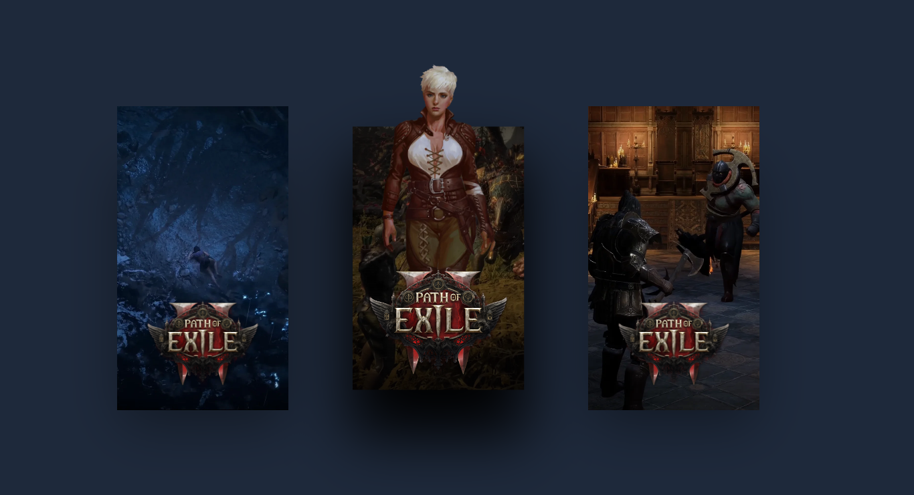

# 3D Cards Display

Simple project that displays poster like image and foreground image with 3D effect.

Project is built with [Nuxt.js](https://nuxt.com/) and [TailwindCSS](https://tailwindcss.com)

## Preview



## Setup

Node.js `v20.8.0`.

Make sure to install the dependencies:

```bash
# npm
npm install
```

## Development Server

Start the development server on `http://localhost:3000`:

```bash
# npm
npm run dev
```

## Production

Build the application for production:

```bash
# npm
npm run build
```

Locally preview production build:

```bash
# npm
npm run preview
```

Check out the [deployment documentation](https://nuxt.com/docs/getting-started/deployment) for more information.
